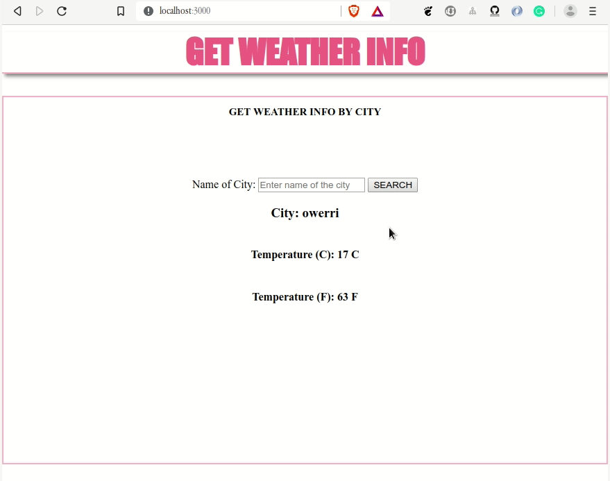

# [Fake Weather Info](https://github.com/vincentiroleh/fakeWeather)

A mini project that displays weather info of cities in the dummy database

### Demo

## Technologies

- [HTML](https://html.com/) -Text Markup Language
- [CSS](https://developer.mozilla.org/en-US/docs/Web/CSS) - Stylesheet language
- [NodeJS](https://nodejs.org/) - Runtime Environment
- [ExpressJs](https://expressjs.com/) - Web Application Framework
- [Axios](https://www.npmjs.com/package/axios) - Promise based HTTP client for the browser and node.js

### Installation

- Install [NodeJS](https://nodejs.org/) on your computer
- Clone this repository using `git clone https://github.com/vincentiroleh/fakeWeather`
- Change director `cd fakeWeather`
- Run `npm install` to install all dependencies
- Run `npm start` to start the server
- Navigate to [localhost:3000](http://localhost:3000/) in browser to access the application

## Author

Vincent Iroleh